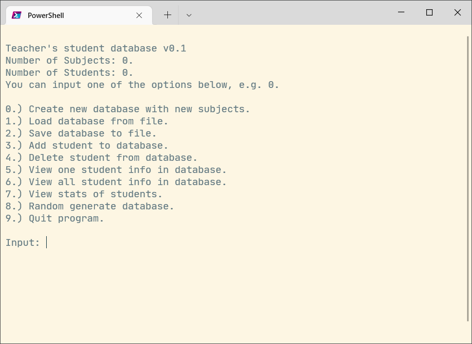

# Student database program

Simple java program (with database) to display student and subjects information. This project was built to teach Java to a student of mine.



## Structure

- GUI
- CLI

### GUI

Uses java swing to display a table and allow to add columns (subject names) and add rows (student informations)

#### Usage

```bash
cd src
# Compile first
javac ./guide/gui/Character.java
javac ./guide/gui/Database.java
javac ./guide/gui/forms/LabelText.java
javac ./guide/gui/forms/MainForm.java
javac ./guide/gui/forms/RowView.java

# Run compiled Java class
java java guide.gui.forms.MainForm
```

### CLI

Does not use java swing, able to prompt for input and add items to the database.

#### Usage

```bash
# Run with Java command
java ./src/guide/cli/Program.java

# Compile first
javac ./src/guide/cli/Program.java -d bin/

# Run compiled Java class
java -cp ./bin guide.cli.Program
```

or by double clicking the scripts (on Windows):

- 0_compile.bat (Compile Java files)
- 1_run.bat (Run compiled Java files)
- 2_clean.bat (Clean up compiled Java files)

## TODO:

- Might want to create an adaptor to combine both GUI/CLI (extract out similar codes for GUI,CLI)